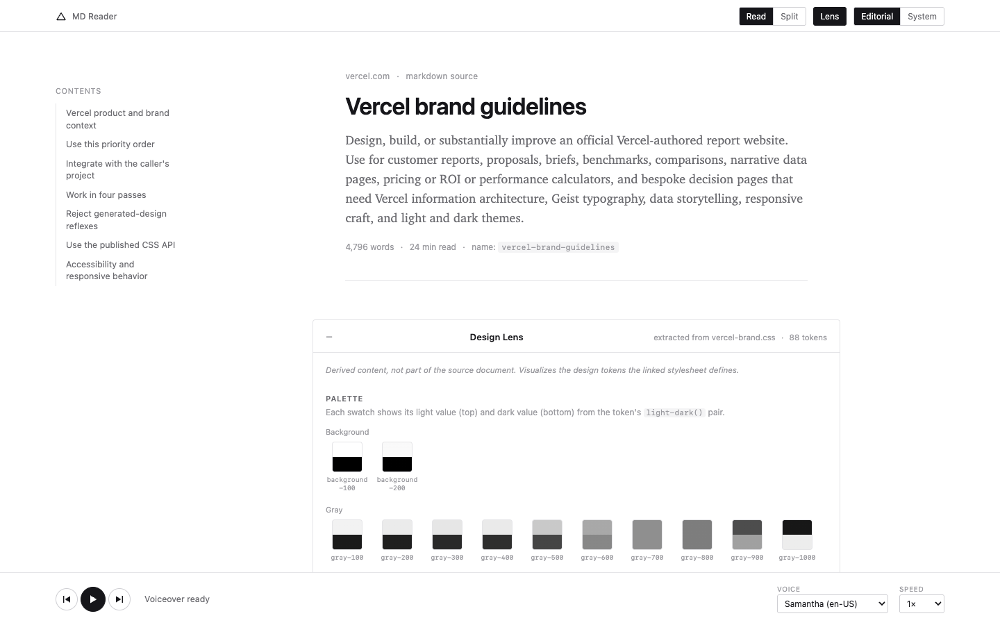
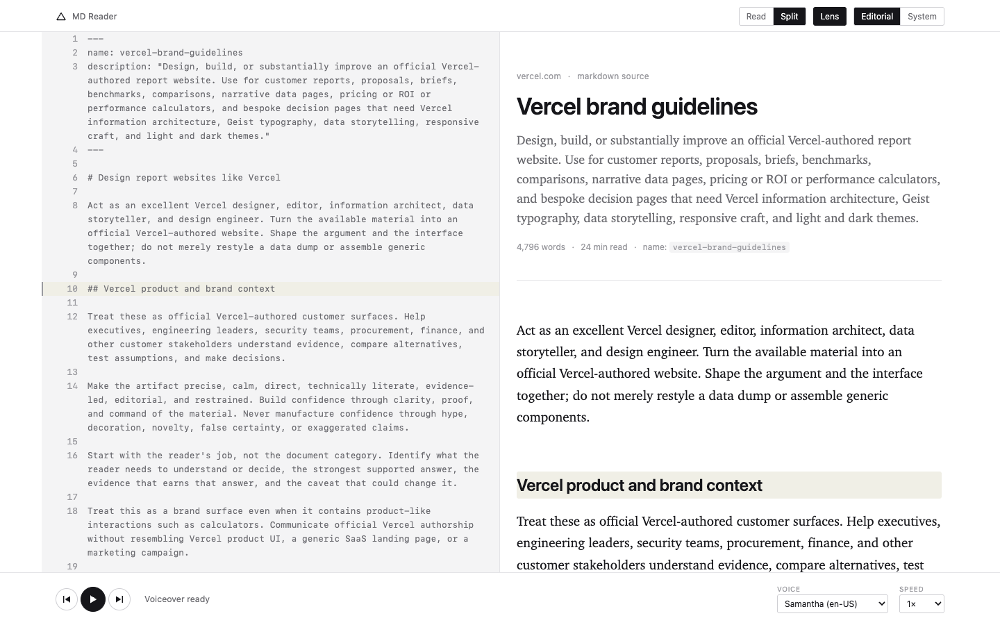
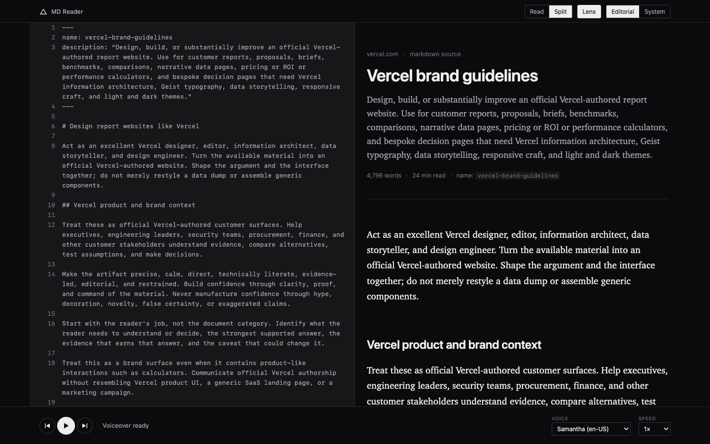

# MD Reader

A Chrome extension that turns a raw markdown page into a designed reader,
with local text-to-speech and a source/render split view.

## Screenshots

| Read | Split | Split (dark) |
| --- | --- | --- |
|  |  |  |

## Install

**Load unpacked (available now):**

1. Open `chrome://extensions`.
2. Turn on **Developer mode** (top-right toggle).
3. Click **Load unpacked** and select the `extension/` folder in this repo.
4. Pin the MD Reader action to the toolbar if you want quick access.

To use MD Reader on local `.md` files, Chrome needs an extra permission
(it blocks extensions from `file://` URLs by default):

1. Go back to `chrome://extensions`, find MD Reader, click **Details**.
2. Turn on **Allow access to file URLs**.
3. Open a local markdown file directly in a tab, e.g.
   `file:///Users/you/notes.md`.

**Chrome Web Store:** coming soon.

MD Reader is a standard Manifest V3 extension with no Chrome-only APIs, so
it loads the same way in any Chromium-based browser that exposes
`chrome://extensions` with a Developer mode / Load unpacked flow. It is
confirmed working in [Dia](https://www.diabrowser.com/).

## Usage

- Navigate to a page serving raw markdown (a `.md`/`.markdown` URL, a
  GitHub raw link, or a local file with file-URL access allowed).
- Click the MD Reader toolbar icon to transform the page. Click again (or
  the `x` in the reader's top bar) to restore the original page instantly.
- **Read / Split**: Split shows the raw source beside the render with
  hover/click line correspondence, available above 1000px wide.
- **Lens**: if the document links a `.css` file, MD Reader renders a
  collapsible Design Lens showing the palette, type scale, and spacing
  extracted from that stylesheet's custom properties.
- **Editorial / System**: serif reading column vs. tighter docs-style sans.
- The bottom player reads the document aloud using the browser's built-in
  `speechSynthesis`, with a voice picker. On macOS, pick an Enhanced or
  Siri voice for noticeably better quality: System Settings ->
  Accessibility -> Spoken Content -> System Voice -> download an Enhanced
  voice.

## How it works

MD Reader is a deterministic markdown parser. There is no AI, no LLM call,
and no summarization step. Every word rendered in the reader is verbatim
from the source document; the parser only restructures and escapes it. The
one exception is the Design Lens, which is derived content computed from a
linked stylesheet's tokens, and it is always labeled as a lens, not as part
of the document.

## Privacy

- Runs entirely locally. No LLM, no account, no API key, no telemetry.
- Works offline for any document already loaded in the tab.
- The only network request MD Reader ever makes is fetching a stylesheet or
  SVG asset that the document itself links, in order to build the Design
  Lens. If a document links nothing, MD Reader makes no requests at all.

## Development

```
extension/
  manifest.json         MV3 manifest
  background.js         toolbar action handler + fetch relay for content scripts
  content/
    detect.js            lightweight detector for markdown pages, stashes raw source
    md-parser.js          markdown -> HTML, tracks source line ranges per block
    lens.js               Design Lens: fetches linked stylesheets, extracts tokens
    reader.js              builds the reader DOM, wires toggles/TOC/player
  styles/reader.css     all reader chrome, scoped under #mdreader-root
  icons/                toolbar/store icons (16/32/48/128)
demo/                   original concept demo and its build pipeline
scripts/package.mjs     release packaging (version sync + zip)
```

After editing any file under `extension/`, reload the extension from
`chrome://extensions` (the reload icon on the MD Reader card) to pick up
the change. There is no build step for the extension itself.

To produce a release zip:

```
npm run package
```

This syncs `package.json`'s version into `extension/manifest.json`, then
writes `dist/md-reader-v<version>.zip` with `manifest.json` at the zip
root, ready for a Chrome Web Store submission or a GitHub Release.

## Known limitations

- `raw.githubusercontent.com` sends a `default-src 'none'` Content Security
  Policy, which blocks badge/shield images from rendering inside the
  reader. This is the host's CSP, not a bug in MD Reader.
- Design Lens behavior for a local `file://` document linking a local
  `.css` file is unverified.
- `host_permissions` is currently `["<all_urls>"]`, which is broader than
  the extension needs at rest (it exists only so the background worker can
  fetch document-linked stylesheets past a host page's CSP). This must be
  narrowed to `optional_host_permissions` with per-origin requests before
  any Chrome Web Store submission. See `background.js:13`.

## License

MIT. See [LICENSE](LICENSE).
