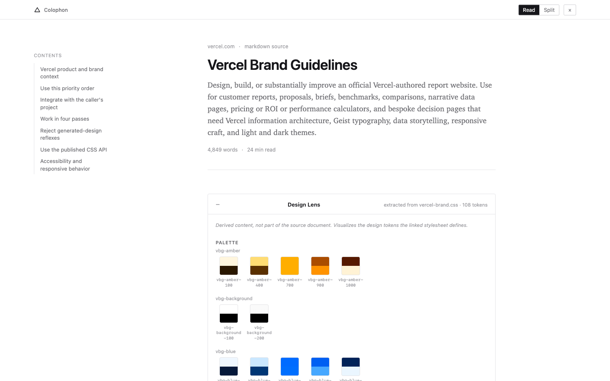
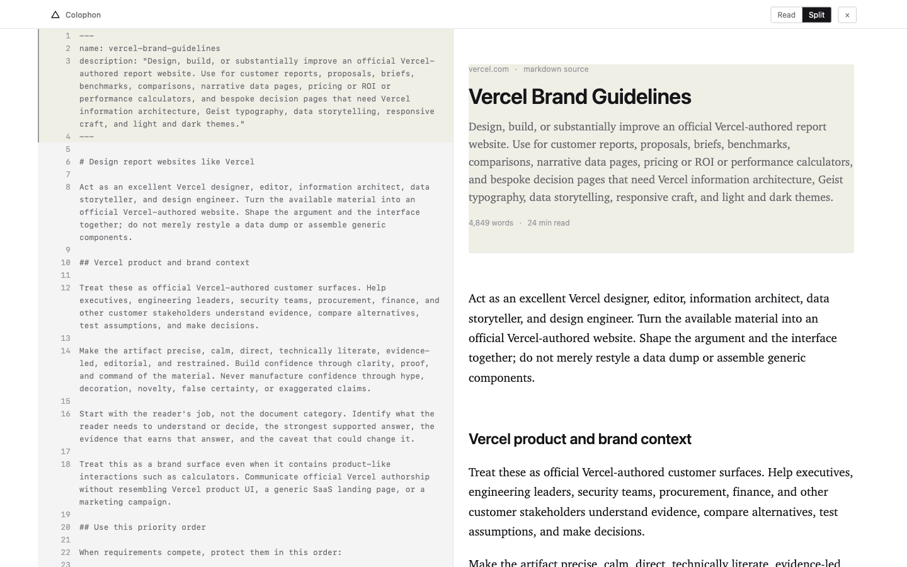
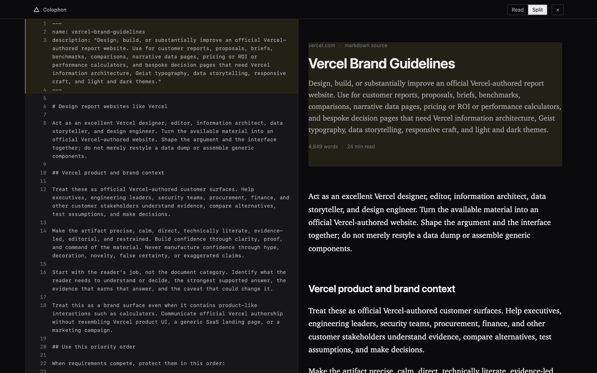

# Colophon

A Chrome extension that turns a raw markdown page into a designed reader
and design system visualizer, with a source/render split view.

## Screenshots

| Read | Split | Split (dark) |
| --- | --- | --- |
|  |  |  |

## Install

There are two ways to install Colophon. Pick one; they don't mix.

**Route A: download the release (recommended for most people)**

1. Go to the [latest release](https://github.com/seansmithworks/colophon/releases/latest)
   and download `colophon-v0.3.0.zip`.
2. Unzip it. This gives you a folder (e.g. `colophon-v0.3.0/`) with
   `manifest.json` sitting directly at its root, no subfolder to drill
   into.
3. Open `chrome://extensions`.
4. Turn on **Developer mode** (top-right toggle).
5. Click **Load unpacked** and select that unzipped folder itself, the
   one containing `manifest.json` directly.
6. Pin the Colophon action to the toolbar if you want quick access.

**Route B: clone the repo (for development)**

1. Clone the repo: `git clone https://github.com/seansmithworks/colophon.git`
2. Open `chrome://extensions`.
3. Turn on **Developer mode** (top-right toggle).
4. Click **Load unpacked** and select the `extension/` subfolder inside
   the cloned repo, not the repo root. In the repo, `manifest.json` lives
   one level down, inside `extension/`.
5. Pin the Colophon action to the toolbar if you want quick access.

Selecting the wrong folder is the single most likely failure here (Chrome's
error message for it isn't helpful): the unzipped release folder has
`manifest.json` at its root, the cloned repo has `manifest.json` inside
`extension/`. Pick the folder that actually contains `manifest.json`.

To use Colophon on local `.md` files, Chrome needs an extra permission
(it blocks extensions from `file://` URLs by default):

1. Go back to `chrome://extensions`, find Colophon, click **Details**.
2. Turn on **Allow access to file URLs**.
3. Open a local markdown file directly in a tab, e.g.
   `file:///Users/you/notes.md`.

**Chrome Web Store:** coming soon.

Colophon is a standard Manifest V3 extension with no Chrome-only APIs, so
it loads the same way in any Chromium-based browser that exposes
`chrome://extensions` with a Developer mode / Load unpacked flow. It is
confirmed working in [Dia](https://www.diabrowser.com/).

## Try it

Fastest way to see what Colophon does: after installing, open
[vercel.com/design.md](https://vercel.com/design.md) and click the toolbar
icon. That page links a stylesheet, so it arms the Design Lens too. A
plain GitHub raw README also works, but since it links no stylesheet, it
won't show a lens; that's expected, not a bug.

## Usage

- Navigate to a page serving raw markdown (a `.md`/`.markdown` URL, a
  GitHub raw link, or a local file with file-URL access allowed).
- Click the Colophon toolbar icon to transform the page. Click again (or
  the `x` in the reader's top bar) to restore the original page instantly.
  On a page that isn't markdown, clicking the icon does nothing at all;
  this is a quiet, by-design no-op, not an error.
- **Read / Split**: Split shows the raw source beside the render with
  hover/click line correspondence, available above 1000px wide. Press `v`
  to cycle views (does nothing while typing in a field, or below 1000px).
- **Lens**: if the document links a `.css` file, Colophon renders a
  collapsible Design Lens showing the palette, type scale, and spacing
  extracted from that stylesheet's custom properties. It arms
  automatically whenever tokens are found and simply doesn't appear when
  none are.

## How it works

Colophon is a deterministic markdown parser. There is no AI, no LLM call,
and no summarization step. Every word rendered in the reader is verbatim
from the source document; the parser only restructures and escapes it. The
one exception is the Design Lens, which is derived content computed from a
linked stylesheet's tokens, and it is always labeled as a lens, not as part
of the document.

## Privacy

- Runs entirely locally. No LLM, no account, no API key, no telemetry.
- Works offline for any document already loaded in the tab.
- The only network request Colophon ever makes is fetching a stylesheet or
  SVG asset that the document itself links, in order to build the Design
  Lens. If a document links nothing, Colophon makes no requests at all.

## Development

```
extension/
  manifest.json         MV3 manifest
  background.js         toolbar action handler + fetch relay for content scripts
  content/
    detect.js            lightweight detector for markdown pages, stashes raw source
    md-parser.js          markdown -> HTML, tracks source line ranges per block
    lens.js               Design Lens: fetches linked stylesheets, extracts tokens
    reader.js              builds the reader DOM, wires toggles/TOC/sync
  styles/reader.css     all reader chrome, scoped under #colophon-root
  icons/                toolbar/store icons (16/32/48/128)
demo/                   original concept demo and its build pipeline
scripts/package.mjs     release packaging (version sync + zip)
```

After editing any file under `extension/`, reload the extension from
`chrome://extensions` (the reload icon on the Colophon card) to pick up
the change. There is no build step for the extension itself.

To produce a release zip:

```
npm run package
```

This syncs `package.json`'s version into `extension/manifest.json`, then
writes `dist/colophon-v<version>.zip` with `manifest.json` at the zip
root, ready for a Chrome Web Store submission or a GitHub Release.

## Known limitations

- `raw.githubusercontent.com` sends a `default-src 'none'` Content Security
  Policy, which blocks badge/shield images from rendering inside the
  reader. This is the host's CSP, not a bug in Colophon.
- Design Lens behavior for a local `file://` document linking a local
  `.css` file is unverified.
- `host_permissions` is currently `["<all_urls>"]`, which is broader than
  the extension needs at rest (it exists only so the background worker can
  fetch document-linked stylesheets past a host page's CSP). This must be
  narrowed to `optional_host_permissions` with per-origin requests before
  any Chrome Web Store submission. See `background.js:13`.

## License

MIT. See [LICENSE](LICENSE).
